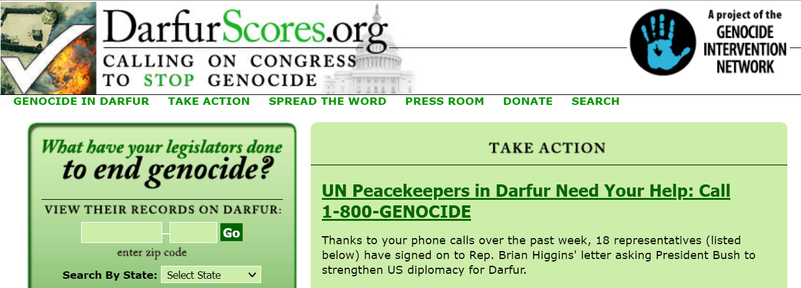

This week, the Genocide Intervention Network was honored to be nominated by the
NetSquared community as a
[2008 Featured Project](https://web.archive.org/web/20080308231814/http://www.netsquared.org/2008/conference)
for our proposal to
[upgrade and extend the DarfurScores.org website](https://web.archive.org/web/20080719230742/http://www.netsquared.org/2008/conference/projects/anti-genocide-action-tracker-genocide-scores-every-politician-state-and-university):

> The Genocide Intervention Network seeks to create a new website, modeled on
> our successful Darfur congressional scorecard,
> **[DarfurScores.org](https://web.archive.org/web/20080708201835/http://www.darfurscores.org/)**,
> tentatively named GenocideScores.org.

Our
current plan for the site — which could change as we explore different options
and hear feedback from our members — has four main components:

- **Collecting together anti-genocide data**, not only on Darfur but on each of
  our
  [areas of concern](https://web.archive.org/web/20080614191436/http://www.genocideintervention.net:80/educate/crisis/overview).
  Instead of being limited to only legislative records, each state would list
  its status on other anti-genocide initiatives like
  [Sudan divestment](https://web.archive.org/web/20080724095105/http://sudandivestment.org/)
  and
  [genocide education](https://web.archive.org/web/20080320063747/http://www.teachagainstgenocide.org:80/).
- **Provide clear illustrations of legislative status.** Instead of just hearing
  about a bill when a member of Congress does (or doesn’t) vote for it, we’ll be
  tracking bills as they move through each chamber.
- **Cross-index a bill’s status with a member’s location.** When the latest bill
  on genocide prevention is up for a vote, anti-genocide activists whose members
  of Congress represent key votes on the legislation will be able to receive
  automatic alerts.
- **Provide embeddable badges or widgets for activists to place on their
  profiles, blogs or websites.** At a glance, both you and visitors to your
  website, blog or social networking profile will be able to see how your state
  and legislators are doing on the question of genocide. And when urgent action
  is needed, these badges will be automatically updated with a special link to
  take action.

**Now, we want your feedback. If you have a chance,
[read through our proposal for DarfurScores.org](https://web.archive.org/web/20080719230742/http://www.netsquared.org/2008/conference/projects/anti-genocide-action-tracker-genocide-scores-every-politician-state-and-university)
and leave a comment** — tell us what you like, what you think could be changed,
what we’re overlooking.

Remember that this is all about our core mission: **empowering individuals and
communities with the tools to prevent and stop genocide.**

We hope this project will result in a valuable new tool, and we’d love to have
your input!
