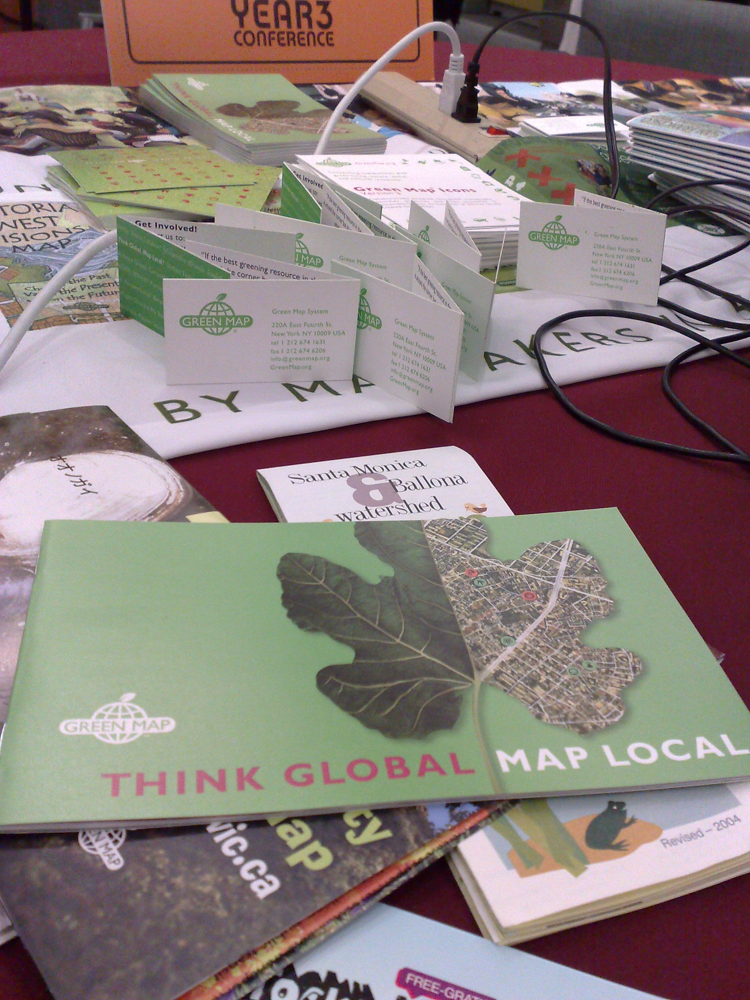
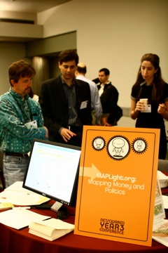
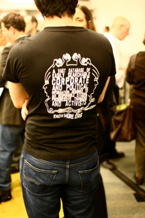
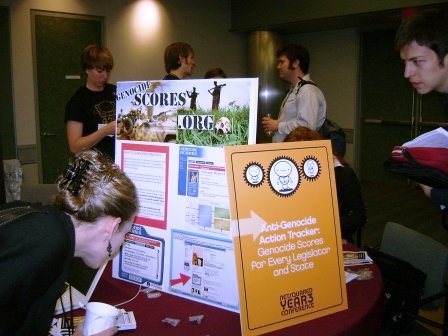

The
[NetSquared Year Three](https://web.archive.org/web/20080710195249/http://www.netsquared.org/mashup 'NetSquared Mashup Challenge')
conference has gotten off to a great start: nonprofit staffers, activists,
techies and funders gathering to talk about -- and award some money to -- using
technology for social change.

There have been a couple of blog entries focusing on two of the
[featured projects](https://web.archive.org/web/20080709050029/http://www.netsquared.org/2008/conference/projects/n2y3_featured_projects 'View the featured projects'),
KnowMore.org and the Genocide Intervention Network.

KnowMore.org's proposal is a Firefox extension that just launched, as
[described in the blog](https://web.archive.org/web/20080605012715/http://www.netsquared.org/blog/dietrich/knowmore-firefox-extension-debuts-netsquared-2008):

> The extension itself acts as a simple lens through which to experience the
> web, a lens that brings into focus the business and political practices of
> corporations that you purchase from. How it works is fantastically simple:
> When you go to a website, Firefox displays a notification bar at the top of
> the page, for corporations that have business practices that you might be
> concerned about, as well as a link to read more. The extension also displays
> visual notifications in search engine results, marking links to corporations
> of concern.

The Genocide Intervention Network's proposal is an anti-genocide legislation
tracker and widget system
[developed by Ivan Boothe](https://web.archive.org/web/20080719230742/http://www.netsquared.org/2008/conference/projects/anti-genocide-action-tracker-genocide-scores-every-politician-state-and-university 'View the NetSquared proposal').
In an interview with GI-NET's Ben Drexler, Aida McArthur asks:

> AM: What is the main challenge your staff is experiencing?
>
> BD: Finding an adequate means of transmitting the actions they are able to
> create based upon their analysis. Our traditional means of disseminating this
> information is via e-mail or phone contact, but desire a faster means of
> communicating to a wider audience to be able to mobilize phone calls from
> activists on a faster turnaround basis.

I'll be continuing to post articles focusing on some of the featured projects --
the
[NetSquared blog](https://web.archive.org/web/20080531044252/http://www.netsquared.org/blog)
is a great place to follow along as well. Some images from the NetSquared
[featured project carnival](https://web.archive.org/web/20080709224453/http://netsquared.org/blog/brenda/n2y3con-project-carnival):

