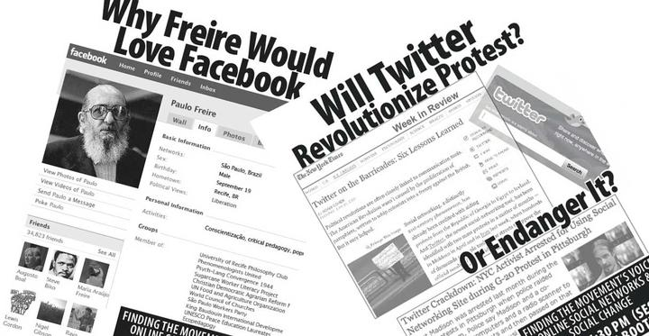

Today at the
[Peace and Justice Studies Association 2009 Conference](https://web.archive.org/web/20091013231101/http://www.peacejusticestudies.org/conference 'Read more about the conference')
at Marquette University, I hosted a workshop called,
"[Finding the Movement's Voice: Online Social Networks and Social Change](https://web.archive.org/web/20091013231106/http://www.peacejusticestudies.org/conference/sessions.php?con=C.4)":

The subtitle of this workshop could be, "Social change has always relied on
social networks -- they just weren't called Facebook." I'm going to be talking
concretely about the _strategy_ of using online tools for social change. This
won't be an ain't-it-cool presentation of shiny technology, nor will it be a
technical exploration of complicated software. It will be an interactive how-to
on making social change work more effective by using online social technology.

While I did use a set of slides, the workshop was participatory and the slides
were mostly illustrative; I hope to publish them here and on
[Slideshare](https://www.slideshare.net/rootwork) with a voiceover soon, but
they're probably not worth posting otherwise.

What I can post is an extended set of resources and tools for those pursuing
social change and want to engage folks online. In addition, much of my
presentation was drawn on earlier presentations and writing, including:

- [Gurus Are Not Enough: A Call for Organizers and Organizing in Social Media](/blog/2009/09/gurus-are-not-enough-call-organizers-organizing-social-media)
- [Social change takes more than social media](/blog/2009/05/social-change-takes-more-social-media)
- [Using Social Networks for Social Change: Facebook, MySpace and More](/blog/2008/10/using-social-networks-social-change-facebook-myspace-more)
- [Community blogs run better on open-source software](/blog/2009/01/community-blogs-run-better-open-source-software)

You may also be interested in some of my earlier academic work on
[third-party nonviolent intervention and unarmed peacekeeping](https://web.archive.org/web/20100129053652/http://quixoticlife.net/topics/tpni),
including a presentation from the 2005 PJSA conference and some of my analysis
published in the journal _Peace & Change_.

### Resources related to technology and social change

_You can [download a PDF](socialchangetechresources.pdf) of a shorter version of
this list; feel free to use or distribute as you like._

#### Guides, case studies and places for inspiration

- [Beth's Blog: How Nonprofits Can Use Social Media](https://bethkanter.org) --
  "A place to capture and share ideas, experiment with and exchange links and
  resources about the adoption challenges, strategy, and ROI of nonprofits and
  social media." Beth Kanter explores the social use by nonprofits of images
  (e.g., Flickr), video (YouTube) and microblogs (Twitter), among other
  technologies.
- [DigiActive](https://web.archive.org/web/20091028013047/http://www.digiactive.org/)
  -- A team of activists and writers chronicling successful uses and case
  studies of technology for social change. Many invaluable resources, such as a
  [guide to using Twitter for activism](https://web.archive.org/web/20091017020359/http://www.digiactive.org/2009/04/13/twitter_guide/)
  and a
  [guide to secure communication](https://web.archive.org/web/20091003030354/http://www.digiactive.org/2009/06/26/secure-comm/).
- [Dear SoSi](https://web.archive.org/web/20100102135322/http://socialsignal.com/dearsosi)
  -- Social Signal's Alexandra Samuel and Rob Cottingham are leaders in social
  media integration and online community development for nonprofits and social
  change groups. They've collected some of their best advice and grouped it by
  audience -- so whether you're a nonprofit executive, a membership director or
  online manager, or an activist on a shoestring budget, Dear SoSi will give you
  some great pointers.
- [NetSquared](https://web.archive.org/web/20090927182734/http://www.netsquared.org/)
  -- A community of nonprofits and groups who are using technology -- especially
  social networks and social media -- for social change. In addition to the
  blog, NetSquared sponsors gatherings in many cities called
  [Net Tuesdays](https://web.archive.org/web/20090817065437/http://netsquared.org/share/meetup/),
  as well as an annual NetSquared conference.
- [New Tactics in Human Rights](https://newtactics.org/) -- Resources organized
  around analysis of potential solutions rather than that of specific issues,
  geographic regions or target groups that allow activists to clearly recognize
  the unique elements of their situation, and to seek promising approaches that
  have worked elsewhere and apply them to new regions or issues. New Tactics
  hosts regular online discussions on effective human rights tactics, both
  online and on the ground.
- [MobileActive.org](https://web.archive.org/web/20091010003010/http://mobileactive.org/)
  -- Case studies and guides on using mobile (cellular) phones for social change
  around the world.
- [Community Organizer 2.0](https://web.archive.org/web/20091021173351/http://www.communityorganizer20.com/)
  -- The blog of Debra Askanase, a veteran community organizer who focuses on
  the strategy of using technology.
- [Apophenia](https://www.zephoria.org/thoughts/) -- Sociological research and
  commentary on the use of social networks like MySpace, Facebook, LiveJournal,
  Xanga and YouTube by teenagers in the United States. danah boyd is a PhD
  candidate at the University of California Berkeley and a fellow at Harvard's
  Berkman Center for Internet and Society.
- [Media Mobilizing Project](https://web.archive.org/web/20100911210708/http://mediamobilizingproject.org:80/)
  -- MMP believes media must be connected to economic and social realities of
  everyday life. The right to free speech means little without the right to be
  heard. By sharing our own stories for the purposes of education, outreach, and
  organizing, we can disrupt the fragmentation of our issues and the isolation
  of our communities, and build the networks necessary to address the root
  causes of the problems we face.
- [Progressive Exchange](https://www.progressiveexchange.org) -- An online
  discussion group of new media and communications directors at many large
  nonprofits and international NGOs.
- [Radical Techies Mailing List](https://lists.mayfirst.org/mailman/listinfo/radical-techies)
  -- A discussion group of many people involved on the technical side of both
  large-scale projects like the World Social Forum and local grassroots
  community groups.

#### Tools and services

- [TechSoup](https://www.techsoup.org/) -- TechSoup is a nonprofit that helps
  other nonprofits in the United States and Canada acquire deeply-discounted
  software and online services. Microsoft Office for $16? Adobe InDesign for
  $60? Flickr accounts for $3/year? It's all in TechSoup's stock. Additionally,
  TechSoup has a vibrant forum community and blog postings relating to the use
  of technology by nonprofits.
- [Idealware](https://web.archive.org/web/20091001051945/http://idealware.org/)
  -- Provides candid Consumer Reports–style reviews and articles about software
  of interest to nonprofits. Through product comparisons, recommendations, case
  studies, and software news, Idealware allows nonprofits to make the software
  decisions that will help them be more effective.
- [Human Rights Data Analysis Group](https://hrdag.org/) -- Designs database
  software, data collection strategies, and statistical techniques to measure
  human rights atrocities; and conducts statistical analysis on behalf of human
  rights projects.
- [Nonprofit Technology Network (NTEN)](https://www.nten.org/) -- A membership
  organization of nonprofit professionals who put technology to use for their
  causes. NTEN sponsors online "webinars" and the annual Nonprofit Technology
  Conference.

#### My background

I am the creative director of Rootwork.org, working with nonprofits and social
change groups, developing websites and doing online strategy around advocacy,
fundraising and member engagement. I helped found the
[Genocide Intervention Network](https://web.archive.org/web/20091012093907/http://www.genocideintervention.net/)
and worked there for four years, first as the director of communications and
later as Internet strategy coordinator.

In 2003, I was part of
[why-war.org](https://web.archive.org/web/20091012093907/http://why-war.org/),
which launched a nationwide campaign of electronic civil disobedience against
the voting machine manufacturer Diebold. Subsequently I've worked with several
social change groups including [Soulforce](https://soulforce.org/) and
[Casino-Free Philadelphia](https://web.archive.org/web/20090722065730/http://www.casinofreephila.org:80/).
