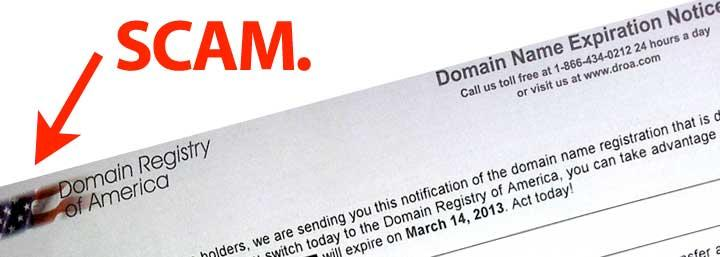

---
title:
  "Domain Registry of America is a scam. Don't let your nonprofit get fooled."
author: Ivan Boothe
date: '2013-02-26'
lastmod: '2022-07-12' # Appends 'edited on' to the publish date

slug: 'domain-registry-america-scam-dont-let-your-nonprofit-get-fooled' # Recommended length is 3 to 5 words.
aliases:
  - /p/130226
description: 'Domain Registry of America sends the owner of a website domain an
  official-looking “expiration notice,” urging the owner to “act today” to
  prevent “loss of your online identity making it difficult for your customers
  and friends to locate you.” Yet Domain Registry of America vastly overcharges
  for domain registration — their entire business model is built on swindling
  people into switching their registration. Don’t let it happen to you!' # For SEO and social media snippets.
summary: 'Domain Registry of America sends the owner of a website domain an
  official-looking “expiration notice,” urging the owner to “act today” to
  prevent “loss of your online identity making it difficult for your customers
  and friends to locate you.” Yet Domain Registry of America vastly overcharges
  for domain registration — their entire business model is built on swindling
  people into switching their registration. Don’t let it happen to you!' # For the post in lists.

draft: false # Change to 'false' to publish this post.
featured: false
toc: false

showDate: true
showReadTime: true
showShare: true

# menu: main

featureImage: 'scam-truck_flickr-jepoirrier.jpg' # Top image on post.
featureImageShade: true # Add a translucent shade to the image to make overlaid text easier to read.
featureImageAlt: 'A scam truck' # Alternative text for featured image.
featureImageCreditFlickr: 'jepoirrier'
# featureImageCreditCustom: 'Top image credit Flickr user [username](https://www.flickr.com/photos/username).'
thumbnail: 'scam-truck_flickr-jepoirrier.jpg' # Image in lists of posts.
# shareImage: 'share.jpg' # For SEO and social media snippets. Falls back to thumbnail (if set) or featureImage.

codeMaxLines: 10 # Override global value for how many lines within a code block before auto-collapsing.
codeLineNumbers: false # Override global value for showing of line numbers within code block.
figurePositionShow: false # Override global value for showing the figure label.
showRelatedInArticle: false # Override global value for showing related posts in this series at the end of the content.

categories:
  - nonprofit technology
tags:
  -
keywords: # Extra keywords in addition to the above, for SEO.
  - Domain Registry of America
  - Domain Registry Services

# Archive taxonomy terms (auto-generated)
year: '2013'
month: '2013-02'
---

**Update, July 12, 2022:** This is an old post, but Domain Registry of America
is still around. It now goes by the name
[Domain Registry Services](https://droa.com/), the better to be globally
misleading, I guess. It still has its old domain name, `droa.com`. I have no
reason to think the facts contained in the original post below aren't still
true.

---

I know how registering a website domain goes in a small nonprofit: A volunteer
or an intern or a staff person’s nephew set up the website years ago and
registered the domain somewhere — which perhaps you only found out when it
suddenly expired, the email address renewal messages were being sent to having
long ago been deleted or moved. Remembering to renew your domain is probably
something you learned (perhaps the hard way) to schedule on your calendar, to
make sure the website doesn’t go down — as it did once for me — when the single
“tech person” on staff is away at a conference.

Into this confusion steps [Domain Registry of America](https://droa.com/), a
bottomfeeding company that intentionally misleads low-information website owners
into vastly overpaying for their domain registration by switching to their
“service.”

**You don’t need to and shouldn’t register your nonprofit website with Domain
Registry of America — don’t be fooled!**

Here’s how it works: Domain Registry of America sends the owner of a website
domain an official-looking “expiration notice” (pictured at right), urging the
owner to “act today” to prevent “loss of your online identity making it
difficult for your customers and friends to locate you.”

How does it get your mailing address? Domain Registry of America trawls “whois”
records, the official listings of contact information every website has.

Many domain registrars offer “whois privacy” or “whois anonymization,” enabling
registrants to substitute the registrar’s own contact information for yours. But
nonprofits, either because of a need for transparency or a lack of knowledge
about the service, often have their official mailing address listed.

Domain Registry of America isn’t any kind of official or government-sanctioned
company (I’ve intentionally refrained from referring to it as _the_ Domain
Registry of America), although that’s clearly the impression they’re aiming for
with their name.

**When a harried nonprofit staffer gets a letter that says “domain name
expiration notice” in big letters at the top, they might well think back to the
last time their website unexpectedly expired and send back their “renewal” — not
realizing they’ve unintentionally transferred their domain.**

Now to be fair, Domain Registry of America carefully words its documents to
specify that this “is not a bill” and that responding will “switch your domain
name registration.” But they’re clearly banking on people not reading closely.

**Domain Registry of America _vastly_ overcharges for domain registrations — $35
per year with their “service,” whereas reputable registrars usually charge
between $10 and $15 per year.**

This company can’t compete on price or service; their entire business model is
built on swindling people into switching their registration. Because nonprofits
are more likely to be low-information customers in this space, and because
they’re likely to have their real contact information listed, nonprofits are at
particular risk of being exploited by Domain Registry of America. I’ve seen at
least two nonprofits nearly go through with the switch before they realized what
was happening.

**Don’t let it happen to your nonprofit. Just say no to Domain Registry of
America!**

### Other resources on Domain Registry of America

- “[Domain name scams](https://web.archive.org/web/20130828012117/http://en.wikipedia.org/wiki/Domain_name_scams),”
  from Wikipedia
- “[Domain Registry of America](https://web.archive.org/web/20130828012117/http://blog.forret.com/projects/domain-registry-of-america/),”
  by Peter Forret
- “[Domain Registry of America scam](https://web.archive.org/web/20130828012117/http://www.gn.apc.org/support/domain-registry-america-scam)”
  from GreenNet
- “[Scam Alert: Domain Registry of America](https://web.archive.org/web/20130828012117/http://www.moorewebexposure.com/blog/internet/scam-alert-domain-registry-of-america/),”
  from Moore Web Exposure
- “[Domain Registry of America Scam Alert](https://web.archive.org/web/20130828012117/http://studio1c.com/business-startup-blog/495-domain-registry-of-america-scam-alert.html),”
  from studio1c
- “[Domain Registry Of America: Scam Alert!](https://web.archive.org/web/20130828012117/http://www.jvfconsulting.com/blog/138/Domain_Registry_Of_America_Scam_Alert.html),”
  by Garrett Blanton
- “[The Domain Registry of America scam](https://web.archive.org/web/20130828012117/http://www.spinweb.net/blog/the-domain-registry-of-america-scam/),”
  by Michael Reynolds
- and my favorite,
  “[Want an Example of Everything That Is Wrong in This World? Domain Registry of America Does Us the Honors](https://web.archive.org/web/20130828012117/http://www.the-name-i-wanted-was-already-taken-so-i-used-a-lot-of-dashes.com/the-domain-registry-of-america-scam/),”
  by The Naming Dude
