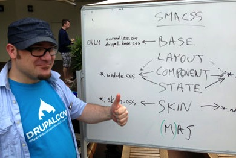

The big news at Drupalcon Portland is that, for the first time at a Drupalcon,
we’re having separate
[frontend](https://portland2013.drupal.org/program/tracks/#frontend) and
[user experience (UX)](https://portland2013.drupal.org/program/tracks/#UX)
tracks. That means we were able to offer even more sessions targeted directly at
frontend developers, and as the local track chair for frontend, I’m really
excited about what we’ve ended up with!

### Groundbreaking frontend featured speakers

First and foremost, of
course, we have **Jonathan Snook** presenting on his concept (and book)
[_Scalable and Modular Architecture for CSS_](http://smacss.com/).

SMACSS
has had a big impact on a lot of frontend developers and themers — and in fact
it’s had a huge impact on Drupal itself. The
[Zen base theme](https://www.drupal.org/project/zen), the most-downloaded Drupal
theme out there, has
[adopted a SMACSS approach](https://www.drupal.org/node/1931746).

And Drupal itself is moving toward SMACSS with
[a re-organization of its CSS](https://www.drupal.org/node/1921610#comment-7096746)
in the upcoming Drupal 8 release.

[**Join Jonathan Snook at Drupalcon Portland on Tuesday, May 21 at 4:30 PM.**](https://portland2013.drupal.org/session/scalable-and-modular-architecture-css.html)

### Drupal 8 and Twig

Oh yeah, so there’s this new version of Drupal coming out pretty soon.

Among the
[many, many awesome things happening with Drupal 8](https://groups.drupal.org/drupal-initiatives),
one of the most relevant to frontend developers is the adoption (with a little
luck) of the [Twig templating engine](https://twig.symfony.com/).

Twig, a component of Symfony — a framework
[being adopted by Drupal 8](https://symfony.com/blog/symfony2-meets-drupal-8) —
will enable themers to write much cleaner (and safer!) code, and enable module
developers to simplify the theming components of their modules.

No joke, at the
[BADCamp 2012 Twig session](https://web.archive.org/web/20150822122025/http://2012.badcamp.net:80/program/sessions/new-theme-layer-drupal-8),
there were literally gasps in the audience as we all saw how cool it was. If
you’re a themer or a frontend developer, don’t miss this!

[**Join Jen Lampton, Fabian Franz and John Albin Wilkins presenting Twig on Wednesday, May 22 at 3:45 PM.**](https://portland2013.drupal.org/session/using-twig-new-template-engine-drupal-8.html)

### And so much more!

I’ve just touched on two of the featured sessions at Drupalcon Portland. In the
coming week I’ll be posting more about some of the other sessions, but you can
[browse the frontend sessions right now](https://portland2013.drupal.org/program/sessions.html)
and start planning to attend your favorites! (Don’t forget
[the User Experience sessions too](https://portland2013.drupal.org/program/sessions.html).)

And if you don’t yet have your ticket to Drupalcon Portland, there’s still time!
[**Grab your ticket by this Friday and save $50 off the on-site ticket price.**](https://portland2013.drupal.org/register.html)

I can’t wait to see everyone here in Portland!
