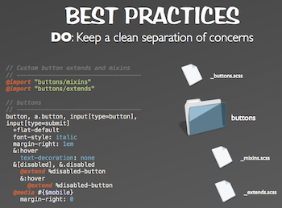

---
title:
  'Ninjas in your code at Drupalcon Portland: Sass with extends and placeholders'
author: Ivan Boothe
date: '2013-05-14'
# lastmod: 2022-07-11 # Appends 'edited on' to the publish date

slug: 'ninjas-your-code-drupalcon-portland-sass-with-extends-placeholders' # Recommended length is 3 to 5 words.
aliases:
  - '/p/130514'
description: "Dale Sande captures the revolution in efficiency that Sass brings,
  and at Drupalcon Portland he's taking us way past Sass basics." # For SEO and social media snippets.
summary: "Dale Sande captures the revolution in efficiency that Sass brings, and
  at Drupalcon Portland he's taking us way past Sass basics." # For the post in lists.

draft: false # Change to 'false' to publish this post.
featured: false
toc: false

showDate: true
showReadTime: true
showShare: true

# menu: main

featureImage: 'qDG7XKJLKbs_unsplash-lazycreekimages.jpg' # Top image on post.
# featureImageShade: true # Add a translucent shade to the image to make overlaid text easier to read.
# featureImageAlt: 'Description of image' # Alternative text for featured image.
# featureImageCreditFlickr: 'username'
featureImageCreditCustom:
  'Top image credit Unsplash user
  [lazycreekimages](https://unsplash.com/photos/qDG7XKJLKbs).'
thumbnail: 'qDG7XKJLKbs_unsplash-lazycreekimages.jpg' # Image in lists of posts.
# shareImage: 'share.jpg' # For SEO and social media snippets. Falls back to thumbnail (if set) or featureImage.

codeMaxLines: 10 # Override global value for how many lines within a code block before auto-collapsing.
codeLineNumbers: false # Override global value for showing of line numbers within code block.
figurePositionShow: false # Override global value for showing the figure label.
showRelatedInArticle: false # Override global value for showing related posts in this series at the end of the content.

categories:
  - Frontend development
tags:
  - CSS
  - Drupal
keywords: # For SEO. Generally a combination of categories and tags.
  - Frontend
  - CSS
  - Drupal

# Archive taxonomy terms (auto-generated)
year: '2013'
month: '2013-05'
---

It’s fair to say that in the last year, adopting the CSS preprocessor
[Sass](https://sass-lang.com/) has completely changed frontend development for
me. That’s a sentiment I’ve heard others express when they started using it —
and I was pretty late to the party.

I got attracted to it initially through variables. We’ve all been there when a
client or a designer wants to change a color and suddenly we have to change
dozens or hundreds of values across CSS.

**[Dale Sande](https://web.archive.org/web/20150919092337/http://www.dalesande.com/)**
captures that kind of revolution in efficiency that Sass brings, as seen in a
screenshot from
[his upcoming presentation at Drupalcon Portland](https://portland2013.drupal.org/node/333.html).

But Dale, who’s [spoken plenty on Sass](https://speakerdeck.com/anotheruiguy)
and organizes the [Seattle Sass meetup](https://www.meetup.com/SASSlang/), is
taking us way past the Sass basics like variables, and that’s why I’m excited to
see his presentation next week.

Around the same time Sass came onto the scene, some thoughtful people were
exploring more maintainable frontend development and CSS architecture through
ideas/acronyms like **OOCSS**, **SMACSS** and **BEM**, and folks like
[Nicole Sullivan](https://github.com/stubbornella/oocss/wiki),
[Jonathan Snook](http://smacss.com/) (a
[Drupalcon featured speaker!](/blog/2013/05/world-class-frontend-track-drupalcon-portland)),
[Nicolas Gallagher](https://nicolasgallagher.com/about-html-semantics-front-end-architecture/),
and [Harry Roberts](https://cssguidelin.es/).

I spoke with Dale about Sass, object-oriented CSS and some the things he’ll be
covering at Drupalcon.
**[Be sure to join me at his session, “Sass: OO’S’CSS w/Extends and Silent Placeholders,” on Wednesday at 2:15 PM!](https://portland2013.drupal.org/node/333.html)**

---

**IB: Some people argue SASS creates bloated code — do you see placeholders
addressing that concern effectively?**

DS: Sass doesn’t create bad code.
[Bad coders do.](https://thesassway.com/sass-doesnt-create-bad-code-bad-coders-do/)

The whole concept of
[placeholder selectors](https://chriseppstein.github.io/blog/2012/08/23/sass-3-2-is-released/)
was designed to fight code bloat and be a more pragmatic solution to OOCSS. In
my presentation, I illustrate how using the various techniques generate code.

The real “ah-ha” moment comes when we see how using placeholder selectors makes
it easier to manage and literally re-use code — thus reducing dreaded CSS bloat.

**IB: What’s the advantage to using silent placeholders over mixins for a set
of rules?**

DS: Simply put, being able to re-use code without duplicating code. The use of
mixins was the first part of being
[DRY with our code](https://en.wikipedia.org/wiki/Don%27t_repeat_yourself).
Looking at the Sass it felt AWESOME! But when we looked at the output CSS, this
is when we realized that we were all living a lie.

Our CSS rules were being duplicated tens, if not hundreds of times. We weren’t
being DRY, we simply put the onus of duplication on the machine.

Placeholder selectors embrace the one of the oldest concepts of CSS and that is
to extend the CSS selector for reuse. But with traditional CSS this was
difficult to do, especially when you were dealing with thousands of lines of
code. Sass’ @extend directive allows developers to create name-spaced reusable
chunks of code that is portable, re-usable and extendable without
duplicating anything.

**IB:
Do you see placeholders as helping to reduce the amount of tight
[coupling](https://en.wikipedia.org/wiki/Coupling_%28computer_programming%29) —
scattering pieces of styles in multiple places?**

DS: While placeholder selectors are a tool that can help with scattered code, it
is not the only solution. Having a file/folder structure that embraces the
different types of code, e.g. CSS selectors, placeholder selectors, mixins and
functions, can assist in creating reusable modulare code and maintain a process
of control over the many parts.
